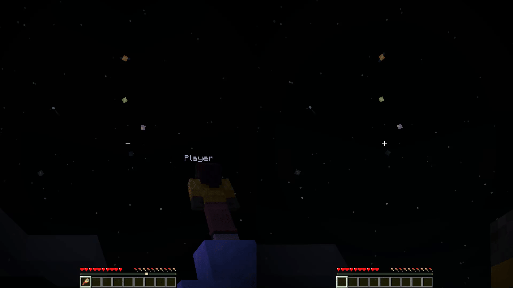

# Spyglass Astronomy Sync
Spyglass Astronomy Sync is an extension of [Spyglass Astronomy](https://modrinth.com/mod/spyglass-astronomy) that adds multiplayer support. With this mod
installed, all players will share the same sky automatically without needing to manually sync via commands.

## Download
- [Modrinth](https://modrinth.com/mod/spyglass-astronomy-sync)
- [CurseForge](https://www.curseforge.com/minecraft/mc-mods/spyglass-astronomy-sync)

## Demo


## Configuration
By default, Spyglass Astronomy Sync disables most `/sga:admin` commands. This behavior can be changed in the
configuration file, located at `config/spyglass-astronomy-sync.json`.

Default configuration:
```json
{
  "allow_admin_commands": false
}
```
- Set `allow_admin_commands` to `true` to allow all `/sga:admin` commands for every player. Note that players with 
permission level 2 or higher will bypass this setting.
- The configuration file is only read at server startup. Restart the server after making changes for them to take 
effect.

## Dependencies
To use Spyglass Astronomy Sync, the following are required:
- [Fabric API](https://modrinth.com/mod/fabric-api)
- [Spyglass Astronomy](https://modrinth.com/mod/spyglass-astronomy) on the client (server does not need it).

Both the server and the client must have Spyglass Astronomy Sync installed for the synchronization to take effect.